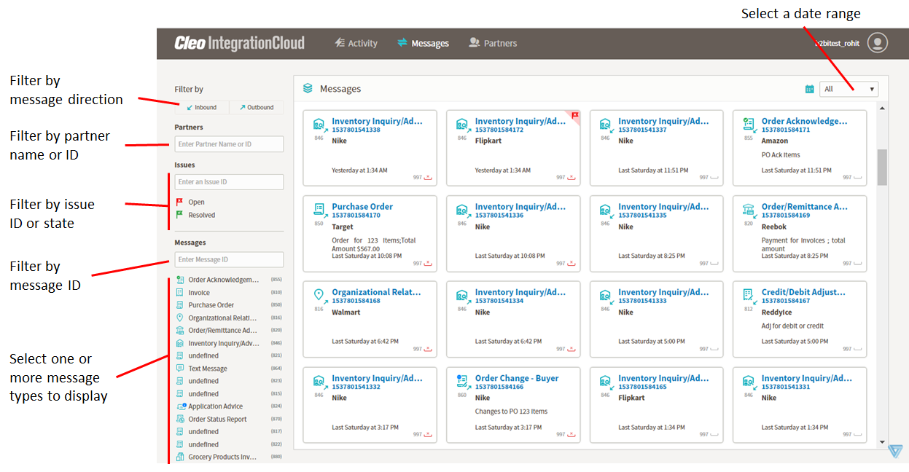
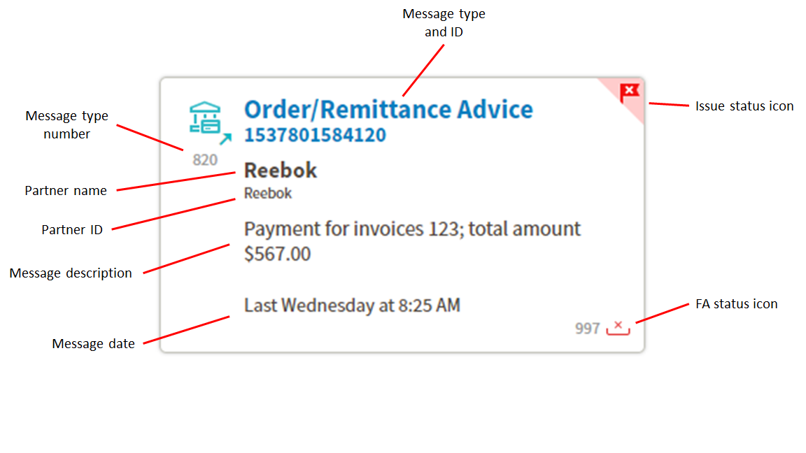
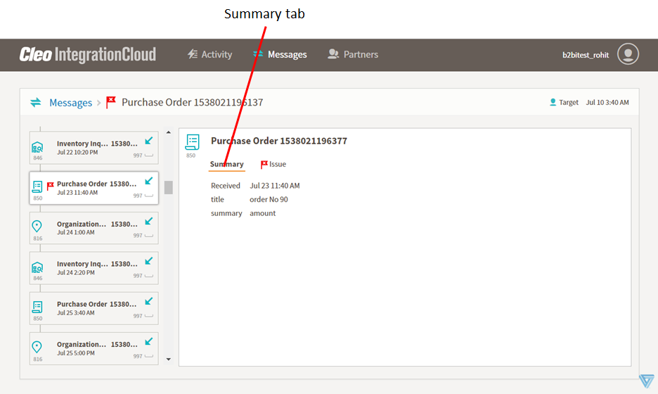

# Messages page

The Messages page displays information about messages on your system in one of two views: 
- Tile view
- Context view

## Tile view

By default, the Messages page displays the Tile view.

In Tile view, the main part of the page is an array of tiles containing high-level information about messages from your system and the left column contains some controls for filtering the messages displayed.

You can filter the messages displayed as follows:
- By message direction -- Click **Inbound** or **Outbound** to show only those messages.
- By partner -- In the **Partners** field, enter a partner's name or ID to display only messages pertaining to that partner. You must enter the entire name or ID. 
- By Issue -- In the **Issues** field, enter an issue number to display only those messages pertaining to that issue. Alternatively, click **Open** or **Resolved** to display only messages in the selected state. 
- By message -- In the **Messages** field, enter a message ID to display the matching message. You must enter the entire message ID.
- By message type -- Select one or more message types to display just those message types. Deselect a message type to hide those messages. All messages are displayed when no message types are highlighted. 
- By date -- Select a date range to display messages that were sent in that range.

Each tile provides details about a single message.

There are two possible issue status icons.

| Icon | Description |
| --- | --- |
|       | There is an open issue associated with this message. |
|       | There was an issue associated with this message that has been resolved.|

 
There are four possible functional acknowledgment (FA) status icons.

| Icon  | Descrption |
| --- | --- |
|       | Successful acknowledgment|
|       | Error with acknowledgment      |
|  | Acknowledgment not received |
|  | Acknowledgment not expected |

Click any message tile to display the Context view. 

## Context view
The Context view displays the message you clicked as part of a series of related messages. 

The left column displays a set of tiles (one message per tile) listed in chronological order. By default, the main part of the page displays detailed information about the message you clicked in the Tile view. To view detailed information about another message, click the corresponding tile in the left column.

If you click a message with a Issue status icon (open or resolved), the right pane displays two tabs: Summary and Issue. 

The Summary tab displays detailed information about the message.

The Issue tab displays information about the issue related to the message extracted from the issue tracking system.

The comments from the ticket are displayed in the Comments section of the Ticket tab. 

You can follow the ticket by clicking the Follow button at the top right corner of the . A user who is following the ticket gets notified via email whenever the ticket is updated.

Ticket description and comments can have attachments. Click on an attachment to open it in a browser. 

You can add your own comments to the ticket in the Comments text box.

Click Messages to return to the Tile view of the Messages page.

