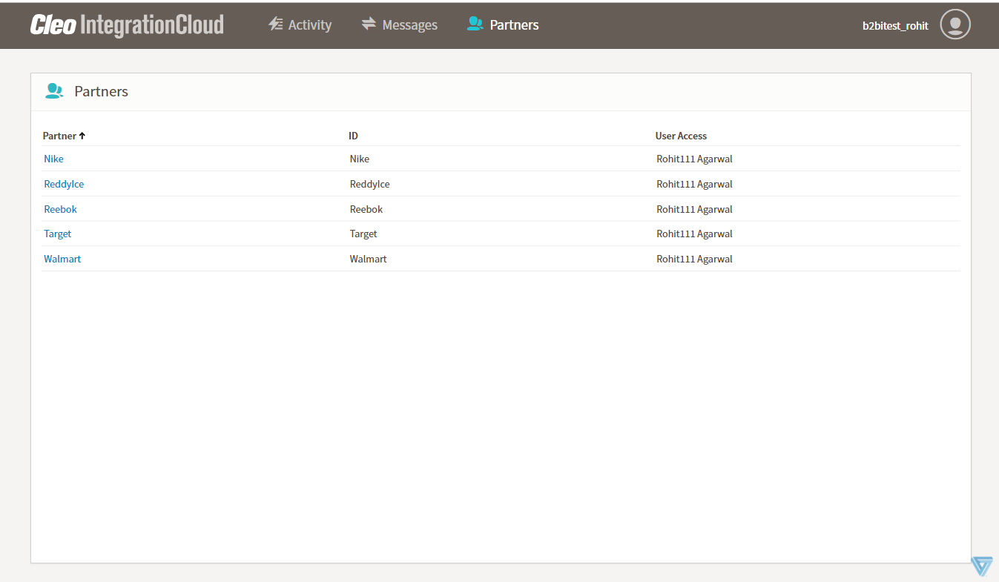
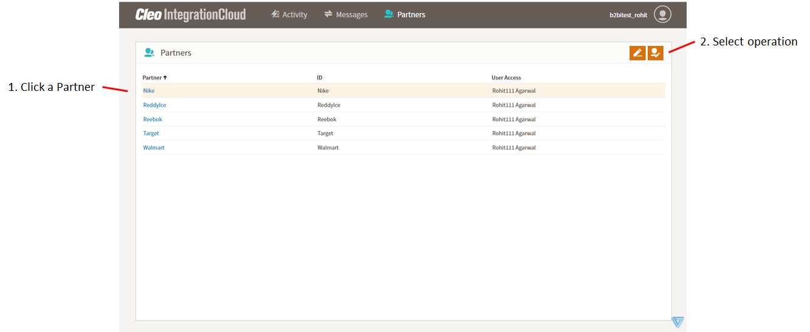
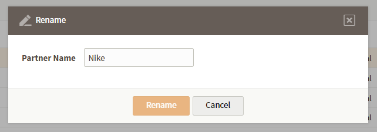
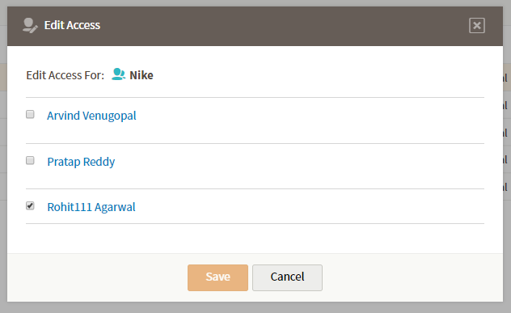

# Partners page

The Partners page displays a list of partners that includes each partner's name, ID, and the users who have access to the partner.

You can update a partner’s name and the list of users who have access to a partner.

Click a partner on the list to highlight it and enable the buttons

- Click the Update Trading Partner Name button to display the Rename dialog box. Enter a new value in the Partner Name field and click Rename.

- Click the Update Trading Partner Permissions button to display the Edit Access dialog box.
Select a check box to enable access to this partner for that user. Clear a check box to disable access to the selected partner for that user.

